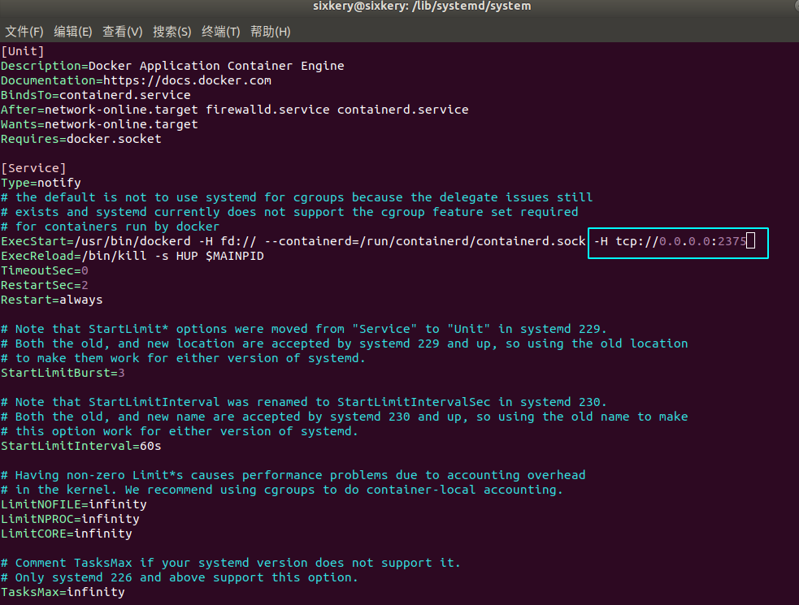

### docker 配置远程连接端口

1. 修改宿主机配置文件

   ```shell
   vim /lib/systemd/system/docker.service
   ```

2. 在 ExecStart 开头的这一行末尾添加 `-H tcp://0.0.0.0:2375`

   

3. 重启 docker

   ```shell
   systemctl daemon-reload
   
   systemctl restart docker
   ```

4. 防火墙开启端口

   ```shell
   firewall-cmd --zone =public --add-port=2375/tcp --permanent
   ```

5. 通过外网访问 : 

   ```shell
   http://localhost/:2375/version
   ```

   

   


### Docker 部署 springboot 项目

1. 打包 springboot 项目。

   ```shell
   $ mvn clean package -Dmaven.test.skip=true
   ```

2. 创建 Dockerfile 文件

   ```dockerfile
   
   # 基础镜像
   FROM jdk:8
   
   # 作者信息
   MAINTAINER "sixkery"
   
   # 添加一个存储空间
   VOLUME /tmp
   
   # 暴露端口
   EXPOSE 8080
   
   # 添加变量，如果使用 dockerfile-maven-plugin, 则会自动替换这里的变量内容
   ARG JAR_FILE=target/code-docker.jar
   
   # 往容器中添加 jar 包
   ADD ${JAR_FILE} app.jar
   
   # 启动镜像自动运行程序
   
   ENTRYPOINT ["java","-Djava.security.egd=file:/dev/urandom","-jar","/app.jar"]
   
   ```

   

3. 把 springboot 打的包和 Dockerfile 放在一个文件夹 code-docker下。

4. 进入文件夹 code-docker下构建镜像

   ```shell
   $ docker build -t code-docker .
   
   # 查看镜像
   $ docker images
   
   ```

5. 运行镜像

   ```shell
   $ docker run -p 8080:8080 -d code-docker --name code-docker
   
   -p: 主机端口:容器端口
      -d: 后台运行，并返回容器 ID
      --name="vueblog": 为容器指定一个名称 
   ```
   
   

""

### CentOS 安装 Docker

1. 命令行安装

   ```shell
   $ curl -sSL https://get.daocloud.io/docker | sh
   ```

2. 启动 docker

   ```SHELL
   $ systemctl start docker
   ```

3. 查看版本

   ```shell
   $ docker --version
   
   # 查看docker 信息
   $ docker info
   ```

4. 配置镜像加速

   在 目录 `/etc/docker/daemon.json ` 下写入内容。若目录不存在创建目录。

   ```json
   {"registry-mirrors":["https://reg-mirror.qiniu.com/"]}
   ```

5. 重新启动 docker

   ```shell
   $ systemctl restart docker
   ```

6. 检验镜像加速是否有效

   在命令行输入 `docker info` 在结果中看到这些信息说明成功。

   ```shell
   $ docker info
   ...
   Registry Mirrors:
       https://reg-mirror.qiniu.com
   ```

   

### Docker 命令

1. 在宿主机中从容器复制文件到宿主机

   ```shell
   $ docker cp 容器ID：容器内文件路径 目标路径
   ```

2. docker 中启动所有容器命令 : `docker start $(docker ps -a | awk '{ print $1}' | tail -n +2)`

3. docker 中关闭所有容器命令 : `docker stop $(docker ps -a | awk '{ print $1}' | tail -n +2)`

4. docker 中删除所有容器命令 : `docker rm $(docker ps -a | awk '{ print $1}' | tail -n +2)`

5. docker 中删除所有镜像命令 : `docker rmi $(docker images | awk '{print $3}' |tail -n +2)`

   Docker 删除容器

   先停掉容器,使用命令 `docker rm 容器ID` 删除容器.


### Docker 安装 nginx

1. 搜索 nginx

   ```shell
   $ docker search nginx
   ```

2. 拉取最新版的 nginx

   ```shell 
   $ docker pull nginx:latest
   ```

3. 查看镜像

   ```shell
   $ docker images
   ```

4. 运行容器

   ```shell
   $ docker run --name nginx -p 8080:80 -d nginx
   
   --name nginx-test: 容器名称
   -p 8080:80: 将本地的 8080 端口映射到容器内部的 80 端口
   -d nginx: 设置容器在后台运行
   ```

5. 配置 nginx 

   1. 进入容器 `docker exec -it nginx bash`  进入目录 `/etc/nginx` 修改 nginx.conf 文件。但是使用 vi 或者 vim 都没有效果，你需要先安装。

   2. 在宿主机配置挂在文件。

      

MySQL 连接

```shell
$ mysql -u root -p

# 输入密码

```

centos7 防火墙管理

查看已经开放的端口

```shell
$ firewall-cmd --list-ports
```

开启端口

```shell
$ firewall-cmd --zone=public --add-port=端口/tcp --permanent
```

重新加载

```shell
$ firewall-cmd --reload    //重新加载
```

